# Self-Service Password Platform

原：**capricornxl/ad-password-self-service** 

## 目录

- [概述](#概述)
- [核心功能](#核心功能)
- [系统架构](#系统架构)
- [快速开始](#快速开始)
- [配置指南](#配置指南)
- [OAuth 认证配置](#oauth-认证配置)
  - [钉钉配置](#钉钉-dingtalk-配置)
  - [企业微信配置](#企业微信配置)
  - [飞书配置](#飞书-feishu-配置)
- [认证、授权与账号绑定安全逻辑](#认证授权与账号绑定安全逻辑)
- [LDAP/AD 配置](#ldapad-配置)
- [AD 服务账号权限配置](#ad-服务账号权限配置)
- [运行方式](#运行方式)
- [生产配置检查清单](#生产配置检查清单)
- [扩展开发指南](#扩展开发指南)
- [界面效果](#界面效果)

---

## 概述

**自助密码服务平台**是一个基于 Django 开发的企业级员工自助密码管理系统，为用户提供安全、便捷的密码重置、修改和账户解锁服务。

### 核心优势
- **双后端支持**：同时支持 Active Directory (AD) 和 OpenLDAP
- **多种身份验证**：集成钉钉、企业微信、飞书认证方式
- **安全可靠**：支持 SSL/TLS 加密传输，服务账号权限最小化
- **开箱即用**：配置文件完善，支持多环境部署
- **移动友好**：原生支持钉钉/企业微信/飞书移动端应用
- **可扩展性**：工厂模式设计，易于扩展新的 OAuth 提供商和 SMS 服务商

---

## 核心功能

### 1. 密码重置（Password Reset）
用户通过验证身份后，可以自助重置 AD/LDAP 账户密码，支持：
- OAuth 身份验证（自动跳转）
- 手动邮箱/用户名验证
- 自定义密码复杂度策略验证
- 密码修改日志审计

### 2. 账户解锁（Account Unlock）
解锁被锁定的 AD 账户，支持：
- 多种身份识别方式
- SMS 短信验证（可选的二次验证）
- 自动恢复账户锁定状态

### 3. 密码修改（Password Change）
支持已认证用户修改密码，保持密码合规性：
- 旧密码验证
- 新密码复杂度检查

### 4. 身份验证
支持认证方式：
- **OAuth 认证**：钉钉、企业微信、飞书（企业级应用）
- **SMS 二次验证**：支持阿里云、腾讯云、华为云等 SMS 服务商

---

## 系统架构

### 分层设计
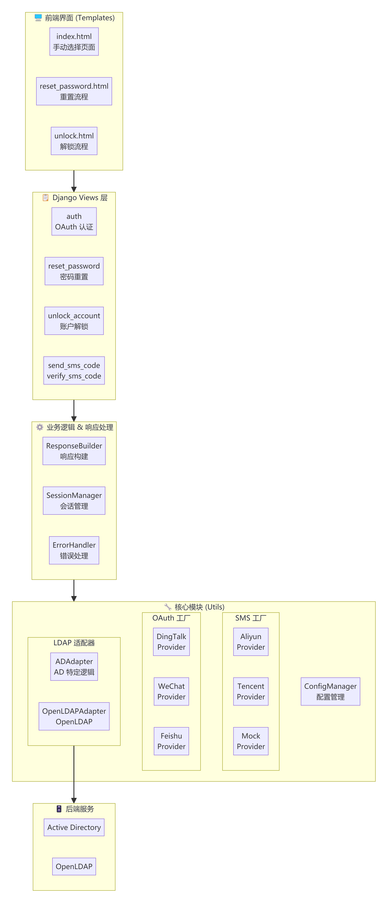

### 核心组件说明

| 组件 | 职责 | 位置 |
|------|------|------|
| **LDAPFactory** | 根据配置自动创建 AD 或 OpenLDAP 适配器 | `utils/ldap/factory.py` |
| **ADAdapter** | 处理 AD 特定操作（NTLM 认证、unicodePwd 属性、lockoutTime 等） | `utils/ldap/ad_adapter.py` |
| **OpenLDAPAdapter** | 处理 OpenLDAP 特定操作（Simple 认证、userPassword 属性等） | `utils/ldap/openldap_adapter.py` |
| **OAuthFactory** | 创建钉钉/企业微信/飞书 OAuth 提供商 | `utils/oauth/factory.py` |
| **ConfigManager** | 单例配置管理，支持 YAML 加载和环境变量注入 | `utils/config/config_manager.py` |
| **ResponseBuilder** | 统一构建 API 响应和页面响应上下文 | `apps/password_manager/response_handler.py` |
| **SMSFactory** | 创建多种 SMS 服务提供商 | `utils/sms/factory.py` |

---

## 快速开始

### 环境要求
- Python 3.10+
- Django 5.2+
- LDAP3 2.9+
- ldap3[gssapi] (可选，用于 Kerberos 认证)


### 本地开发环境设置

#### Windows 开发环境

```cmd
# 1. 创建虚拟环境
python -m venv venv
venv\Scripts\activate

# 2. 安装依赖
pip install -r requirements.txt

# 3. 设置环境变量
set APP_ENV=dev

# 4. 启动开发服务器
python manage.py runserver 0.0.0.0:8000
```

#### Linux/Mac 开发环境

```bash
# 1. 创建虚拟环境
python3 -m venv venv
source venv/bin/activate

# 2. 安装依赖
pip install -r requirements.txt

# 3. 设置环境变量
export APP_ENV=dev

# 4. 启动开发服务器
python manage.py runserver 0.0.0.0:8000
```

### 访问应用

打开浏览器访问：`http://localhost:8000`

---

## 配置指南

### 先理解：这个项目需要配置哪几类东西？

这套系统不是单纯的“改密码页面”，它需要同时打通三类系统：

| 配置类别 | 作用 | 不配置好的表现 |
|---------|------|----------------|
| 应用自身配置 | 控制标题、域名、会话密钥、入口页面、缓存、日志 | 服务启动失败、CSRF 报错、回调 URL 不匹配 |
| OAuth 应用配置 | 让钉钉/企业微信/飞书确认“当前访问者是谁” | 免登失败、拿不到用户详情、提示授权码过期 |
| LDAP/AD 配置 | 查询账号并执行改密、重置、解锁 | 找不到账号、权限不足、AD 拒绝修改密码 |
| 账号绑定规则 | 把 OAuth 返回的邮箱/手机号/userid 映射成 LDAP/AD 登录名 | 张三登录了企业微信，却匹配不到 AD 里的 `zhangsan` |
| 可选 SMS 配置 | 在 OAuth 基础上追加短信二次验证 | 开启后无法发码、手机号解析失败 |

配置时建议按这个顺序来：先让应用启动，再让 OAuth 免登成功，再确认能查到 LDAP/AD 用户，最后再打开短信、严格证书校验等增强项。一步到位听起来很酷，实际排错时会变成一团毛线球。

### 配置文件加载规则

项目启动时会按 `APP_ENV` 决定读取哪个配置文件：

| 启动环境变量 | 实际读取文件 | 适合场景 |
|-------------|--------------|----------|
| 不设置 `APP_ENV` | `conf/config.yaml` | 生产默认配置 |
| `APP_ENV=dev` | `conf/config.dev.yaml` | 本地开发 |
| `APP_ENV=prod` | `conf/config.prod.yaml` | 显式生产环境 |

`conf/config.yaml.example` 只是模板，项目不会直接读取它。首次部署时请先复制一份：

```powershell
# Windows PowerShell，本地开发
Copy-Item conf/config.yaml.example conf/config.dev.yaml
$env:APP_ENV = "dev"
python manage.py runserver 0.0.0.0:8000
```

```bash
# Linux / Docker 服务器，生产默认文件
cp conf/config.yaml.example conf/config.yaml
python manage.py runserver 0.0.0.0:8000
```

### 新手配置步骤

#### 1. 生成应用密钥

`app.secret_key` 用于 Django Session 和安全相关签名，必须至少 32 个字符。项目启动后不要随意更换，否则已有会话会全部失效。

```bash
python -c "import secrets; print(secrets.token_urlsafe(48))"
```

写入配置：

```yaml
app:
  title: "密码自助服务"
  debug: false
  secret_key: "替换为上面生成的随机字符串"
  allowed_hosts:
    - "pwd.company.com"
```

#### 2. 配置访问域名和入口行为

`oauth.home_url` 建议填写“域名或主机名”，不要带 `http://` 或 `https://`，例如 `pwd.company.com`。代码会根据当前请求协议拼接成回调地址。

```yaml
app:
  # index：先进入手动修改密码页面；auth：打开首页就进入免登认证
  landing_page: "index"
  # 在钉钉/企业微信/飞书移动端内置浏览器中是否自动进入免登
  auto_redirect_in_mobile: false

oauth:
  home_url: "${HOME_URL:pwd.company.com}"
  # 默认 OAuth 成功后进入重置密码页面，也可以改成 /unlockAccount
  redirect_url_prefix: "/resetPassword"
```

如果通过 Nginx/OpenResty 暴露 HTTPS，请确保外部访问地址、OAuth 平台后台配置、`HOME_URL` 三者使用同一个域名。

#### 3. 选择 OAuth 平台

当前支持：

```yaml
auth:
  provider: "wework"   # 可选：ding、wework、feishu
  session_timeout: 300
  session_expire_at_browser_close: true
```

具体应用凭证统一写在 `oauth_providers` 下：

```yaml
oauth_providers:
  ding:
    corp_id: "${DING_CORP_ID}"
    app_key: "${DING_APP_KEY}"
    app_secret: "${DING_APP_SECRET}"
    app_id: "${DING_AGENT_ID}"

  wework:
    corp_id: "${WEWORK_CORP_ID}"
    agent_id: "${WEWORK_AGENT_ID}"
    agent_secret: "${WEWORK_AGENT_SECRET}"

  feishu:
    app_id: "${FEISHU_APP_ID}"
    app_secret: "${FEISHU_APP_SECRET}"
```


#### 4. 配置"OAuth 用户信息 → LDAP/AD 账号"的绑定规则

这是账号安全的核心配置。

OAuth 平台返回的是企业通讯录里的用户信息，LDAP/AD 里真正能改密码的是账号名。    
后台会确保当前授权认证的用户与LDAP/AD中的对应账号是匹配对应的，不会产生越权问题。    
即：每个用户只能修改、重置或解锁自己的LDAP/AD账号！

项目会按 `primary` 和 `fallback` 顺序取字段，然后用 `format2username()` 转成用户名：

- `user@company.com` 会转成 `user`
- `DOMAIN\user` 会转成 `user`
- `user` 会转成小写 `user`

常见推荐：

```yaml
oauth:
  user_identifier_mapping:
    ding:
      primary: "email"
      fallback:
        - "org_email"
        - "orgEmail"
        - "biz_mail"
        - "mobile"
    wework:
      primary: "email"
      fallback:
        - "mobile"
        - "userid"
    feishu:
      primary: "email"
      fallback:
        - "mobile"
        - "userid"
```

如果你的 AD 账号是邮箱前缀（例如邮箱 `zhangsan@company.com`，AD 登录名 `zhangsan`），优先用 `email` 最稳。

如果 AD 账号是工号或手机号，请把 OAuth 平台里对应字段放到 `primary`，并确认 LDAP 搜索过滤器也按同一标识查找。

#### 5. 配置 LDAP/AD 连接

AD 推荐使用 LDAPS 636 端口；重置密码和解锁通常需要服务账号。最小示例：

```yaml
ldap:
  type: "ad"
  host: "ad.company.com"
  domain: "company.com"
  login_user: "svc_pwd_reset"
  login_password: "${LDAP_PASSWORD}"
  use_ssl: true
  port: 636
  base_dn: "dc=company,dc=com"
  search_filter: "(&(objectclass=user)(sAMAccountName={}))"
  search_filter_by_email: "(&(objectclass=*)(mail={}))"

  ad:
    authentication: "ntlm"
    tls:
      validate: "none"       # 联调阶段可用 none；生产建议 required 并配置 CA
      ca_certs_file: ""
      validate_hostname: true
```

OpenLDAP 最小示例：

```yaml
ldap:
  type: "openldap"
  host: "ldap.company.com"
  login_user: "cn=admin,dc=company,dc=com"
  login_password: "${LDAP_PASSWORD}"
  use_ssl: true
  port: 636
  base_dn: "ou=people,dc=company,dc=com"
  search_filter: "(&(objectclass=inetOrgPerson)(uid={}))"

  openldap:
    authentication: "simple"
    password_hash: "ssha"
    tls:
      validate: "none"
```

#### 6. 配置密码策略

用户提交的新密码会先经过本地策略校验，再提交给 LDAP/AD。如果 AD 域策略更严格，最终仍以 AD 返回结果为准。

```yaml
password_policy:
  min_length: 8
  max_length: 30
  require_uppercase: true
  require_lowercase: true
  require_digits: true
  require_special_chars: true
  forbidden_patterns:
    - "123456"
    - "password"
  forbidden_password_file: ""   # 可填写弱密码字典路径，例如 conf/weak_passwords.txt
```

#### 7. 可选：开启短信二次验证

默认 `sms.enabled: false`。开启后，用户在 OAuth 认证成功后还需要短信验证码才能重置或解锁。

```yaml
sms:
  enabled: true
  provider: "aliyun"   # mock、aliyun、tencent、huawei

  mobile_mapping:
    sources:
      - type: "ldap"
        field: "mobile"
      - type: "oauth"
        field: "mobile"

  aliyun:
    access_key_id: "${SMS_ACCESS_KEY}"
    access_key_secret: "${SMS_ACCESS_SECRET}"
    sign_name: "密码服务"
    template_code: "SMS_123456789"
```

手机号解析会按 `sms.mobile_mapping.sources` 顺序查找。建议优先使用 LDAP/AD 中的人事主数据手机号，OAuth 作为补充。

#### 8. 可选：配置代理、缓存和日志

如果服务器访问钉钉/企业微信/飞书 API 需要代理：

```yaml
network:
  proxy:
    enabled: true
    http_proxy: "http://proxy.company.com:3128"
    https_proxy: "http://proxy.company.com:3128"
    no_proxy: "localhost,127.0.0.1,ad.company.com"
```

缓存用于 Session、限流、短信验证码等：

```yaml
cache:
  backend: "memory"    # 单机推荐 memory；多实例建议 database 或外部改造共享缓存
```

日志路径：

```yaml
logging:
  level: "INFO"
  file_path: "${LOG_PATH:log/app.log}"
```

### 环境变量注入

配置文件支持 `${VAR_NAME}` 和 `${VAR_NAME:默认值}`：

```yaml
ldap:
  host: "${LDAP_HOST:ad.company.com}"
  login_password: "${LDAP_PASSWORD}"
```

生产环境建议把密码、Secret、短信 AccessKey 放到环境变量或 Docker `.env`，不要明文提交到 Git。

**Windows PowerShell：**

```powershell
$env:APP_ENV = "dev"
$env:HOME_URL = "pwd.company.com"
$env:LDAP_PASSWORD = "your_password"
$env:WEWORK_CORP_ID = "wwxxxxxxxx"
$env:WEWORK_AGENT_ID = "1000001"
$env:WEWORK_AGENT_SECRET = "xxxxxxxx"
```

**Linux / Mac：**

```bash
export APP_ENV=prod
export HOME_URL=pwd.company.com
export LDAP_PASSWORD='your_password'
export WEWORK_CORP_ID='wwxxxxxxxx'
export WEWORK_AGENT_ID='1000001'
export WEWORK_AGENT_SECRET='xxxxxxxx'
```

**Docker Compose `.env`：**

```ini
HOST_IP=0.0.0.0
HOME_URL=pwd.company.com
DJANGO_PORT=9000
NGINX_HTTP_PORT=8001
ENABLE_HTTPS=false

LDAP_PASSWORD=your_password
WEWORK_CORP_ID=wwxxxxxxxx
WEWORK_AGENT_ID=1000001
WEWORK_AGENT_SECRET=xxxxxxxx
LOG_PATH=log/app.log
```

常用环境变量对应关系：

| 环境变量 | 配置路径 | 说明 |
|---------|---------|------|
| `HOME_URL` | `oauth.home_url` | OAuth 回调域名，不建议带协议 |
| `LOG_PATH` | `logging.file_path` | 应用日志路径 |
| `LDAP_HOST` | `ldap.host` | LDAP/AD 服务器地址 |
| `LDAP_PASSWORD` | `ldap.login_password` | LDAP/AD 服务账号密码 |
| `DING_CORP_ID` | `oauth_providers.ding.corp_id` | 钉钉企业 ID |
| `DING_AGENT_ID` | `oauth_providers.ding.app_id` | 钉钉 AgentId / 应用 ID |
| `DING_APP_KEY` | `oauth_providers.ding.app_key` | 钉钉 AppKey |
| `DING_APP_SECRET` | `oauth_providers.ding.app_secret` | 钉钉 AppSecret |
| `WEWORK_CORP_ID` | `oauth_providers.wework.corp_id` | 企业微信 CorpId |
| `WEWORK_AGENT_ID` | `oauth_providers.wework.agent_id` | 企业微信 AgentId |
| `WEWORK_AGENT_SECRET` | `oauth_providers.wework.agent_secret` | 企业微信应用 Secret |
| `FEISHU_APP_ID` | `oauth_providers.feishu.app_id` | 飞书 App ID |
| `FEISHU_APP_SECRET` | `oauth_providers.feishu.app_secret` | 飞书 App Secret |
| `SMS_ACCESS_KEY` | `sms.aliyun.access_key_id` | 阿里云 SMS AccessKey |
| `SMS_ACCESS_SECRET` | `sms.aliyun.access_key_secret` | 阿里云 SMS AccessSecret |
| `TENCENT_SMS_SECRET_ID` | `sms.tencent.secret_id` | 腾讯云 SMS SecretId |
| `TENCENT_SMS_SECRET_KEY` | `sms.tencent.secret_key` | 腾讯云 SMS SecretKey |

---

## OAuth 认证配置

### 钉钉 (DingTalk) 配置

#### 第一步：在钉钉工作台创建应用

1. 登录 [钉钉开发者后台](https://open.dingtalk.com/)
2. 点击"自建应用" → "创建应用"
3. 选择应用类型为 **"H5 微应用"**
4. 填写应用基本信息

#### 第二步：获取必要的凭证

创建成功后，在应用首页获取：
- **AgentId**：应用 ID
- **CorpId**：企业 ID
- **AppKey**：应用 Key
- **AppSecret**：应用密钥

#### 第三步：配置权限

在应用权限中勾选：
- ✅ 通讯录只读权限
- ✅ 邮箱、手机号等个人信息
- ✅ 设置权限范围为"全部员工"或自行选择

#### 第四步：配置安全域名

在应用管理中配置：
- **安全域名**：`pwd.company.com`
- **IP 地址**：应用服务器的公网 IP
- **应用首页地址**：`https://pwd.company.com/`

钉钉当前前端流程使用 `dd.runtime.permission.requestAuthCode` 在钉钉客户端内获取免登码，然后跳转到 `/resetPassword?code=...`，所以请优先在钉钉客户端内打开应用测试。

#### 第五步：修改 config.yaml

```yaml
auth:
  provider: "ding"

oauth:
  user_identifier_mapping:
    ding:
      primary: "orgEmail"  # 优先使用企业邮箱
      fallback:
        - "biz_mail"  # 备选：业务邮箱
        - "mobile"    # 备选：手机号

# 钉钉 OAuth 应用配置（通过环境变量注入）
oauth_providers:
  ding:
    corp_id: "${DING_CORP_ID}"
    app_key: "${DING_APP_KEY}"
    app_secret: "${DING_APP_SECRET}"
    app_id: "${DING_AGENT_ID}"
```

设置环境变量：

```bash
set DING_CORP_ID=ding1234567890
set DING_AGENT_ID=1234567
set DING_APP_KEY=dingxxxxx
set DING_APP_SECRET=dingyyyyy
```

参考截图配置：
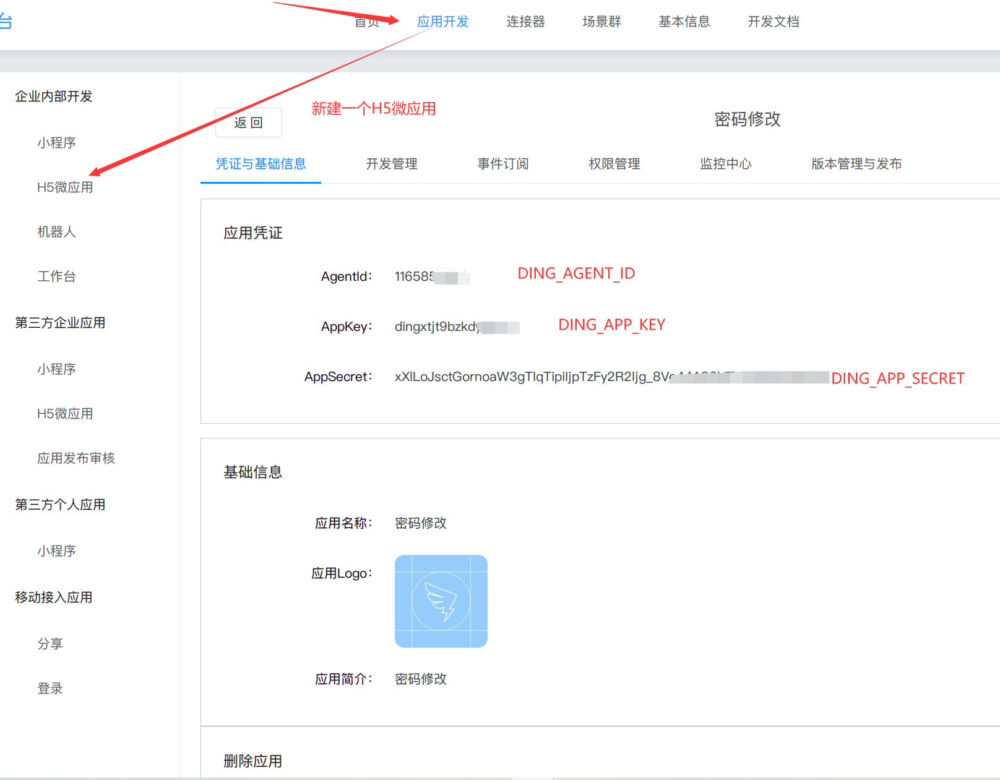

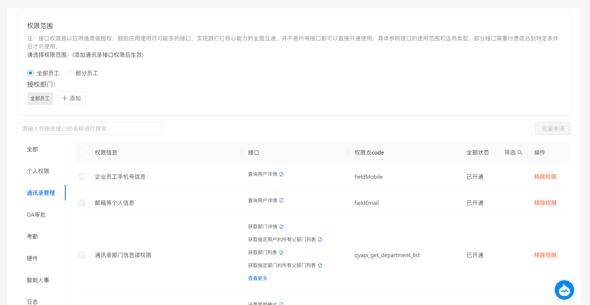
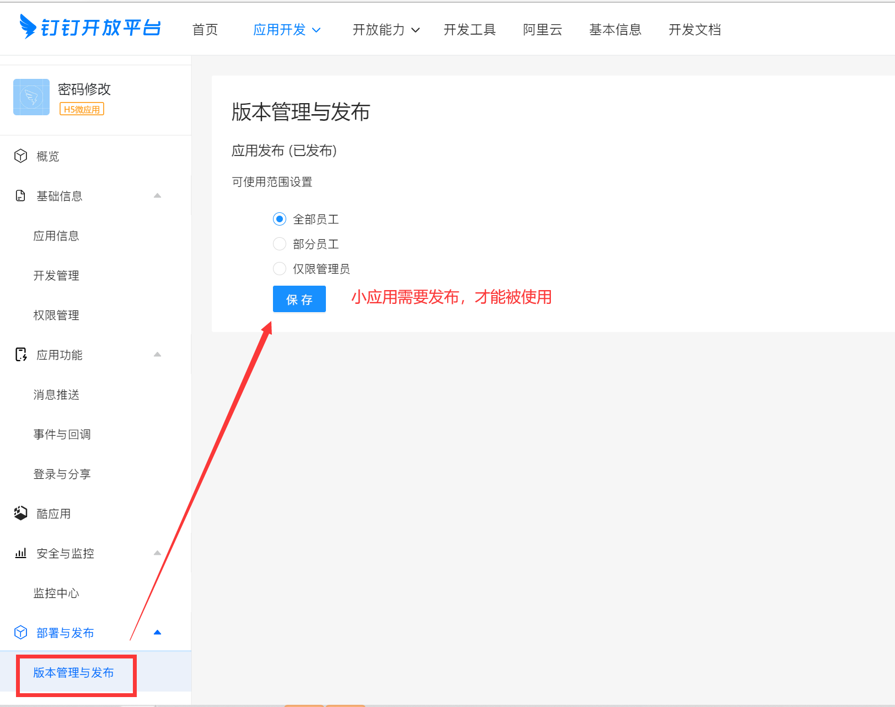

---

### 企业微信配置

#### 第一步：创建应用

1. 登录企业微信管理后台
2. 进入"应用管理" → "创建应用"
3. 选择应用类型为 **"H5 应用"**
4. 填写应用名称和相关信息

#### 第二步：获取企业凭证

- **企业 ID (CorpId)**：企业微信的唯一标识
- **应用 ID (AgentID)**：应用的唯一标识
- **应用密钥 (Secret)**：应用的密钥

#### 第三步：配置权限

应用需要获取以下权限：
- ✅ 读取成员基础信息
- ✅ 读取成员详细信息（代码使用 `snsapi_privateinfo` 并调用 `getuserdetail`）

#### 第四步：配置网页授权及 J-SDK

在应用管理中配置：
- **可信域名**：`pwd.company.com`
- **网页授权回调域名**：`pwd.company.com`
- **企业可信 IP**：应用服务器的公网 IP
- **应用主页**：`https://pwd.company.com/`

#### 第五步：修改 config.yaml

```yaml
auth:
  provider: "wework"

oauth:
  user_identifier_mapping:
    wework:
      primary: "email"  # 优先使用邮箱
      fallback:
        - "mobile"  # 备选：手机号
        - "userid"  # 备选：用户 ID

# 企业微信 OAuth 应用配置（通过环境变量注入）
oauth_providers:
  wework:
    corp_id: "${WEWORK_CORP_ID}"
    agent_id: "${WEWORK_AGENT_ID}"
    agent_secret: "${WEWORK_AGENT_SECRET}"
```

设置环境变量：

```bash
set WEWORK_CORP_ID=wechatxxxxx
set WEWORK_AGENT_ID=1000001
set WEWORK_AGENT_SECRET=wechatsecret
```

参考截图：

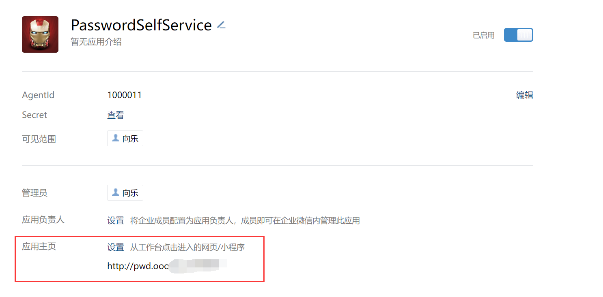
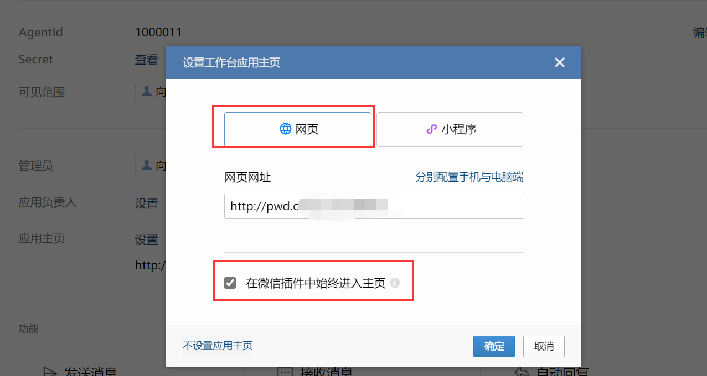


---

### 飞书 (Feishu) 配置

#### 第一步：创建企业自建应用

1. 登录 [飞书开发者后台](https://open.feishu.cn/app)
2. 点击"创建企业自建应用"
3. 填写应用名称和描述

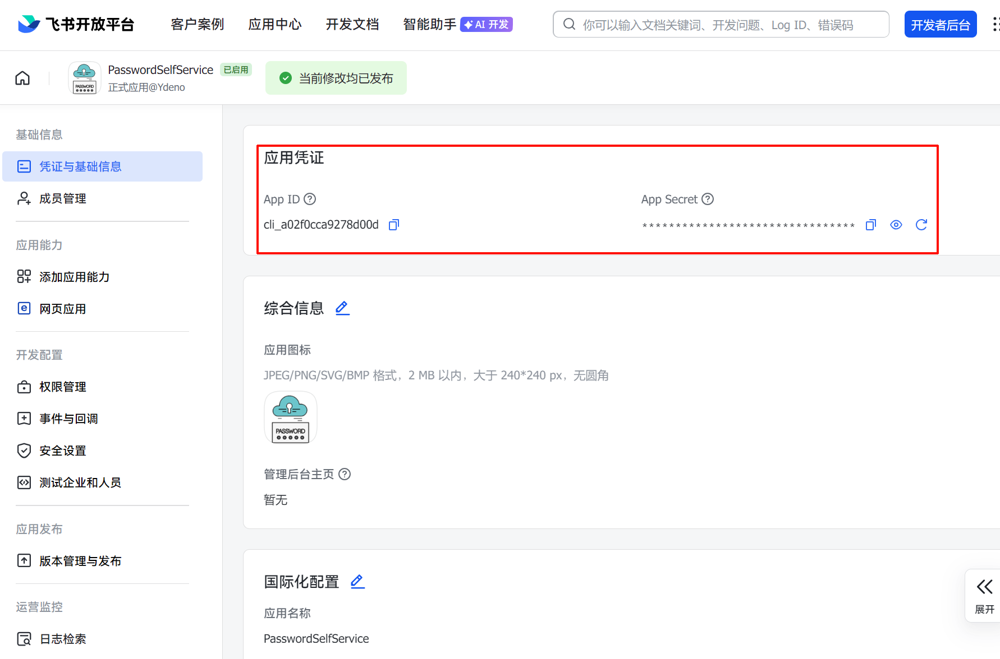

#### 第二步：获取应用凭证

在应用"凭证与基础信息"页面获取：
- **App ID**：应用唯一标识
- **App Secret**：应用密钥


#### 第三步：配置网页应用

1. 进入"应用功能" → "网页"
2. 点击"添加网页应用"
3. 配置应用信息

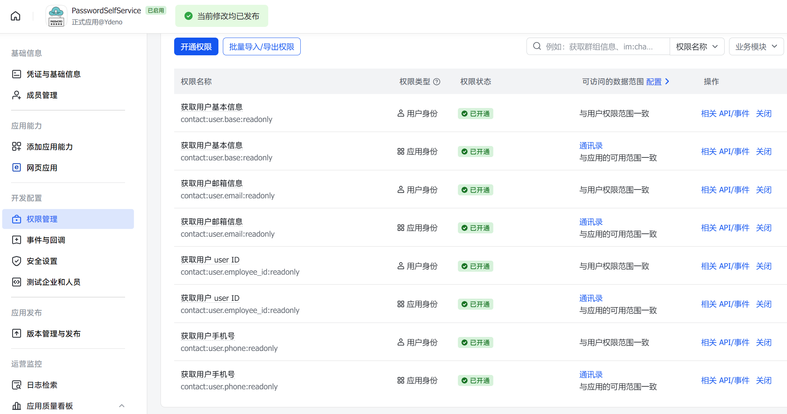

#### 第四步：配置权限

在"权限管理"中启用必要的权限：
- ✅ `authen:user_info:read` 或飞书后台对应的“获取用户身份信息”权限
- ✅ 如需用邮箱、手机号、工号做账号绑定，请在飞书后台额外开启对应用户信息权限


#### 第五步：配置安全设置

在"安全设置"中配置：
> 回调地址必须与系统生成的 `redirect_uri` 完全一致。当前代码默认使用 `/resetPassword`，不要随手加或删末尾斜杠。
1. **重定向 URL**：添加回调地址
   - 格式：`https://pwd.company.com/resetPassword`
   
2. **H5 可信域名**：添加应用域名
   - 格式：`pwd.company.com`

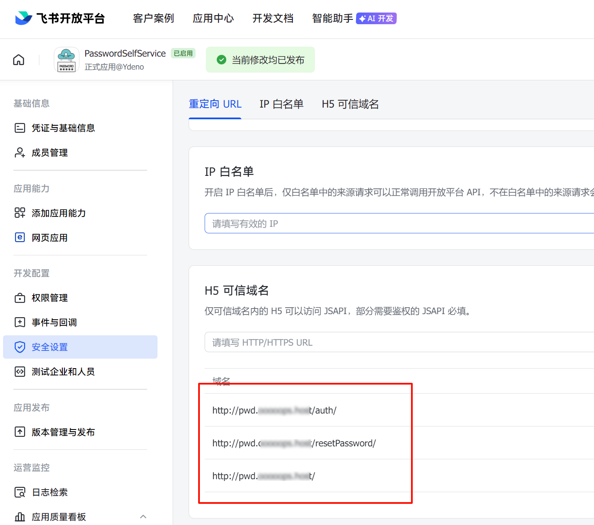
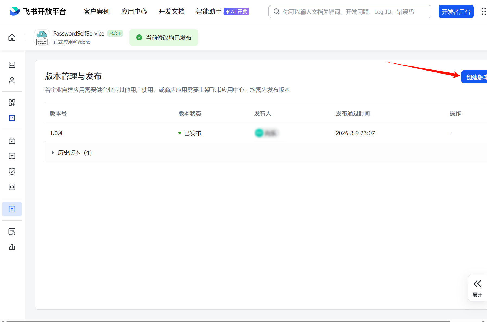

#### 第六步：创建版本并发布

1. 进入"版本管理与发布"
2. 创建新版本
3. 提交审核并发布

#### 第七步：修改 config.yaml

```yaml
auth:
  provider: "feishu"

oauth:
  user_identifier_mapping:
    feishu:
      primary: "email"  # 优先使用邮箱
      fallback:
        - "mobile"  # 备选：手机号
        - "open_id"  # 备选：飞书用户ID

# 飞书 OAuth 应用配置
oauth_providers:
  feishu:
    app_id: "${FEISHU_APP_ID}"
    app_secret: "${FEISHU_APP_SECRET}"
    # 可选：飞书内部提取用户标识的字段，默认 open_id
    user_identifier_mapping: "open_id"
```

设置环境变量：

```bash
set FEISHU_APP_ID=cli_xxxxxxxxxxxxx
set FEISHU_APP_SECRET=xxxxxxxxxxxxxxxxxxxxxxxxxx
```

---

## 认证、授权与账号绑定安全逻辑

### 一句话理解

平台不会因为用户在页面上填了某个 `username` 就允许改密码。它的核心逻辑是：

1. 先由钉钉/企业微信/飞书完成免登录认证，确认“当前访问者是谁”；
2. 再从 OAuth 返回的可信用户信息中提取账号标识；
3. 将账号标识格式化为 LDAP/AD 用户名；
4. 立即到 LDAP/AD 查询该账号是否真实存在；
5. 把“OAuth 身份 + LDAP/AD 用户名 + 授权码 + 会话信息”绑定到服务端 Session；
6. 用户提交重置或解锁时，再次校验请求里的 username 是否与 Session 中绑定的身份一致；
7. 校验通过后，才调用 LDAP/AD 执行重置密码或解锁。

也就是说，真正的安全边界在服务端：OAuth 证明人，LDAP/AD 确认账号，Session 绑定防止中途换账号。

### 重置密码流程

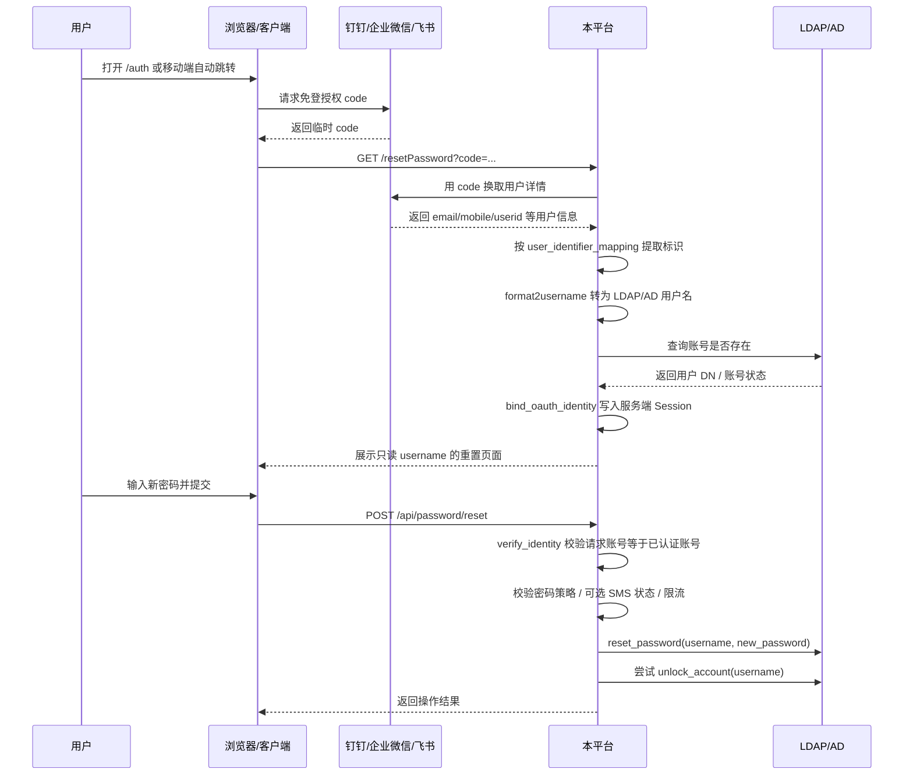

### 如何确保“绑定的是本人账号”？

关键点在这几个服务端检查：

| 检查点 | 代码位置 | 作用 |
|-------|----------|------|
| OAuth code 换用户详情 | `provider.get_user_detail()` | code 只能由企业平台签发，用于确认当前访问者 |
| 字段映射 | `get_user_identifier()` | 只从 OAuth 返回信息中取账号标识，不信任用户手填 |
| 用户名格式化 | `format2username()` | 将邮箱、`DOMAIN\username` 统一成 LDAP/AD 登录名 |
| LDAP/AD 存在性校验 | `ldap_adapter.get_user_dn(username)` | OAuth 用户必须能在 LDAP/AD 中找到对应账号 |
| Session 身份绑定 | `SessionManager.bind_oauth_identity()` | 服务端保存已认证 username、oauth_id、code、时间戳、IP、User-Agent |
| 提交时身份一致性校验 | `SessionManager.verify_identity()` | 防止把页面参数改成别人的 username 后提交 |
| 授权码时效校验 | `verify_auth_code()` / `verify_identity()` | 当前认证默认 5 分钟有效，过期需重新授权 |

因此，攻击者即使修改浏览器里的隐藏字段或请求参数，例如把 `username=zhangsan` 改成 `username=lisi`，服务端也会因为 Session 中绑定的 OAuth 身份不一致而拒绝。

### 本项目是如何防止 OAuth 认证后越权修改其他用户？

这里要特别区分两个概念：

- **认证**：OAuth 平台证明“当前登录者是谁”。
- **授权**：本平台决定“这个登录者只允许操作哪个 LDAP/AD 账号”。

本平台的授权对象不是前端传来的 `username`，而是服务端在 OAuth 回调阶段绑定下来的 `oauth_username`。

用户后续能不能重置密码或解锁账号，取决于请求账号是否与这个服务端绑定身份完全一致。

#### 服务端防越权链路

1. 用户完成 OAuth 免登后，平台调用 `provider.get_user_detail(code, home_url)` 从钉钉/企业微信/飞书获取用户详情。
2. 平台调用 `get_user_identifier(user_info, provider_type)`，只从 OAuth 返回的可信字段中提取账号标识，例如 `email`、`mobile`、`userid`。
3. 平台调用 `format2username(identifier)` 将标识转换为 LDAP/AD 用户名，例如 `zhangsan@company.com` 转为 `zhangsan`。
4. 平台调用 `ldap_adapter.get_user_dn(username)` 确认这个账号真实存在于 LDAP/AD。
5. 平台调用 `SessionManager.bind_oauth_identity()`，把认证结果写入服务端 Session 的固定 key：`_oauth_auth`。
6. 用户提交 `/api/password/reset` 或 `/api/account/unlock` 时，服务端重新格式化请求中的 `username`。
7. 服务端调用 `SessionManager.verify_identity(request, username)`，比较请求账号和 Session 中的 `oauth_username`。
8. 如果不一致，立即返回 `UNAUTHORIZED`，并记录安全事件，不会执行 `reset_password()` 或 `unlock_account()`。

#### 篡改请求时会发生什么？

假设张三通过 OAuth 登录后，Session 中绑定的是：

```text
_oauth_auth.oauth_username = "zhangsan"
```

如果他在浏览器开发者工具或抓包工具中把提交参数改成：

```text
username = "lisi"
```

服务端会执行如下判断：

```text
请求 username: lisi
Session oauth_username: zhangsan
判断结果: 不一致，拒绝操作
```

对应结果：

- 密码重置接口 `/api/password/reset` 会返回 `UNAUTHORIZED`；
- 账号解锁接口 `/api/account/unlock` 会返回 `UNAUTHORIZED`；
- 审计日志会记录 `unauthorized_password_reset_attempt` 或 `unauthorized_unlock_attempt`；
- LDAP/AD 写操作不会被调用。

所以，“页面输入框只读”只是用户体验层面的限制，真正的防越权控制在服务端完成。

#### 防越权依赖的配置前提

这套保护依赖管理员正确配置账号绑定规则。请重点确认：

| 配置项 | 要求 |
|--------|------|
| `oauth.user_identifier_mapping.*.primary` | 应指向能唯一对应 LDAP/AD 账号的字段，优先推荐企业邮箱或工号 |
| `oauth.user_identifier_mapping.*.fallback` | 只能放同样可信且能唯一绑定账号的字段，不建议随意把多人可共享或不稳定字段作为兜底 |
| `ldap.search_filter` | 必须按映射后的 username 查找唯一用户 |
| `ldap.base_dn` | 应限制在允许自助操作的用户 OU 范围内，避免搜索范围过大 |
| OAuth 应用可见范围 | 应限制在允许使用自助密码服务的员工范围内 |

如果 OAuth 字段与 LDAP/AD 账号不是一一对应关系，平台会“安全地拒绝”或“绑定到错误账号”。

后者是配置风险，不是前端权限能补救的；上线前必须用真实员工样本验证映射结果。

#### 管理员自测越权保护

上线前建议做一次负向测试：

1. 用测试用户 `zhangsan` 完成 OAuth 登录，进入重置密码页面。
2. 打开浏览器开发者工具或使用抓包工具，把提交请求中的 `username` 改成另一个测试账号 `lisi`。
3. 提交请求。
4. 预期结果：
   - 页面或接口返回“无权操作，认证信息不匹配”；
   - 响应错误码为 `UNAUTHORIZED`；
   - `lisi` 的 LDAP/AD 密码没有变化；
   - 审计日志中出现越权尝试记录。

### 密码修改、密码重置、账号解锁的差异

| 功能 | 入口 | 身份校验方式 | LDAP/AD 操作方式 |
|------|------|--------------|------------------|
| 修改密码 | `/` → `/api/password/change` | 用户输入旧密码，LDAP/AD 用旧密码认证 | 使用用户自己的凭据执行 `change_password` |
| 重置密码 | `/auth` → `/resetPassword` → `/api/password/reset` | OAuth 免登 + Session 身份绑定 + 可选 SMS | 使用服务账号执行 `reset_password` |
| 解锁账号 | `/unlockAccount` → `/api/account/unlock` | OAuth 免登 + Session 身份绑定 + 可选 SMS | 使用服务账号执行 `unlock_account` |

修改密码要求用户知道旧密码；重置密码和解锁账号不要求旧密码，所以必须依赖 OAuth 身份绑定、LDAP/AD 存在性校验、服务账号最小权限和审计日志共同保护。

### 还有哪些安全保护？

- **Session 防固定攻击**：OAuth 认证成功后调用 `session.cycle_key()` 轮换 Session ID。
- **短有效期**：认证上下文默认 5 分钟有效，超时后需要重新授权。
- **可选二次验证**：`sms.enabled: true` 后，重置和解锁前必须先完成短信验证。
- **限流**：密码重置、账号解锁、短信发送和验证码验证都有基于缓存的频率限制。
- **密码策略**：新密码会先按 `password_policy` 做长度、复杂度、弱口令和正则规则校验。
- **账号状态检查**：写密码前会检查账号是否禁用，账号不存在或禁用时拒绝操作。
- **审计日志**：OAuth 成功/失败、密码重置、账号解锁、限流、安全事件都会写审计日志。
- **服务账号权限校验**：启动时可检查服务账号是否属于危险管理员组，避免使用过大的域权限。
- **LDAPS/TLS**：AD 修改 `unicodePwd` 需要加密通道，生产环境必须使用 LDAPS 或等效安全连接。

### 管理员最需要确认的绑定规则

上线前请拿 3~5 个真实员工做交叉检查：

| 员工 | OAuth 返回字段 | 映射后 username | LDAP/AD 实际账号 | 是否一致 |
|------|----------------|-----------------|------------------|----------|
| 张三 | `email=zhangsan@company.com` | `zhangsan` | `sAMAccountName=zhangsan` | ✅ |
| 李四 | `userid=10086` | `10086` | `uid=10086` | ✅ |

如果这里不一致，不要靠用户自己输入账号来“补救”，应该调整 `oauth.user_identifier_mapping` 或 LDAP 搜索过滤器，让平台能够稳定、自动地绑定到正确账号。

## LDAP/AD 配置

### 配置选项说明

#### 通用 LDAP 配置（AD 和 OpenLDAP 共用）

```yaml
ldap:
  type: "ad"  # 选择 "ad" 或 "openldap"
  
  # 服务器连接
  host: "ad.company.com"      # LDAP 服务器地址
  port: 636                   # SSL: 636, 非 SSL: 389
  use_ssl: true               # 密码修改必须启用 SSL
  
  # 认证信息
  login_user: "DOMAIN\svc_account"     # 服务账号
  login_password: "${LDAP_PASSWORD}"   # 密码（使用环境变量）
  
  # 搜索配置
  base_dn: "dc=company,dc=com"  # LDAP 搜索基准
  search_filter: ""              # 自定义搜索过滤器（空则使用默认）
```

#### Active Directory (AD) 专用配置

```yaml
ldap:
  ad:
    # 认证方式
    authentication: "ntlm"  # "ntlm"（推荐）或 "simple"
    
    # 属性映射
    attributes:
      password: "unicodePwd"          # AD 密码属性
      username: "sAMAccountName"      # 用户名属性
      lockout_time: "lockoutTime"     # 锁定状态属性
      account_control: "userAccountControl"  # 账号状态
    
    # TLS/SSL 证书验证
    tls:
      validate: "none"              # "none"、"optional"、"required"
      ca_certs_file: ""             # CA 证书路径
      validate_hostname: true       # 验证主机名
```

#### OpenLDAP 专用配置

```yaml
ldap:
  openldap:
    # 认证方式
    authentication: "simple"  # OpenLDAP 使用 SIMPLE 认证
    
    # 属性映射
    attributes:
      password: "userPassword"       # OpenLDAP 密码属性
      username: "uid"                # 用户名属性
      lockout_time: "pwdAccountLockedTime"  # 锁定属性
    
    # 密码加密算法
    password_hash: "ssha"  # "ssha"、"sha"、"md5" 等
    
    # ppolicy (Password Policy) 配置
    ppolicy:
      enabled: true
```

---

## AD 前置条件

### ⚠️ SSL/TLS 配置要求（关键）

在使用 Active Directory 进行密码重置或账户解锁之前，**必须确保 AD 服务器已启用 SSL/TLS 加密连接**。这是 AD 密码修改操作的强制要求。

#### 为什么需要 SSL？

- **安全性**：密码在网络传输中必须加密，AD 不允许通过明文连接修改密码
- **认证协议**：AD 的 `unicodePwd` 属性修改只能在 SSL 连接上进行

#### AD 服务器 SSL 配置检查

请 AD 管理员验证以下项：

1. **证书安装**
   ```powershell
   # 查看 AD 证书
   Get-ADCertificate -Filter {Subject -like "*LDAPS*"}
   ```

2. **LDAPS 端口启用**（默认 636）
   ```bash
   # 测试 LDAPS 连接
   telnet ad.company.com 636
   ```

3. **应用配置**
   ```yaml
   ldap:
     host: "ad.company.com"
     port: 636              # SSL 端口
     use_ssl: true          # 必须设置为 true
     use_tls: false         # 与 use_ssl 互斥
   ```

#### 常见问题排查

| 问题 | 原因 | 解决方案 |
|------|------|--------|
| "Connection refused" | LDAPS 未启用 | 联系 AD 管理员启用 LDAPS |
| "SSL: CERTIFICATE_VERIFY_FAILED" | CA 证书不受信任 | 配置 `ldap.ad.tls.ca_certs_file` |
| "Reset password failed" | 使用了非 SSL 连接 | 确保 `use_ssl: true` 且 `port: 636` |

---

## AD 服务账号权限配置

### 为什么需要服务账号？

密码重置和账户解锁操作需要在 AD 中执行修改操作，这些操作只能由具有特定权限的服务账号来进行。通过使用最小权限原则（Principle of Least Privilege），服务账号只被赋予必要的权限，增强系统安全性。

⚠️ **前置条件**：在完成以下步骤前，请确保已按照上一节的要求配置 AD SSL/TLS。

### 配置步骤

#### Step 1: 创建服务账号

在 AD 管理员机器上运行 PowerShell（需要 Admin 权限）：

```powershell
# ===== 基础变量 =====
# 账号显示名 (请根据实际情况修改)
$Name              = "SvcPasswordReset"
# 登录账号名 (请根据实际情况修改)
$SamAccountName    = "svc_pwd_reset"
# 用户主名 (UPN) (请根据实际情况修改)
$UPNSuffix         = "company.com"
# 完整 UPN (请根据实际情况修改)
$UserPrincipalName = "$SamAccountName@$UPNSuffix"
# OU 路径 (请根据实际情况修改)
$OUPath            = "OU=ServiceAccounts,OU=Users,DC=company,DC=com"
# 密码 (请根据实际情况修改)
$PlainPassword     = "ComplexPassword123!"
# 账号密码（请根据公司密码策略设置复杂密码）
$SecurePassword    = ConvertTo-SecureString $PlainPassword -AsPlainText -Force
# 账号描述
$Description       = "自助密码重置服务账号（仅密码重置权限）"

# ===== 创建用户 =====
New-ADUser -Name $Name `
           -SamAccountName $SamAccountName `
           -UserPrincipalName $UserPrincipalName `
           -AccountPassword $SecurePassword `
           -Enabled $true `
           -PasswordNeverExpires $true `
           -Description $Description
```

**参数说明：**
- `-Name`：账号显示名称
- `-SamAccountName`：登录账号（Windows 登录使用）
- `-UserPrincipalName`：用户主名（UPN 格式）
- `-PasswordNeverExpires`：密码永不过期
- `-Enabled`：启用账号

#### Step 2: 授予委派权限

为服务账号分配必要权限，仅限于特定 OU 内的用户操作：

```powershell
# 定义目标 OU（包含需要重置密码的用户）
$targetOU = "OU=Employees,DC=company,DC=com"
$targetDomain = "COMPANY"
$targetAccount = "$targetDomain\svc_pwd_reset"

# Reset password
dsacls $targetOU /I:S /G "${targetAccount}:CA;Reset Password;user"

# Unlock account
dsacls $targetOU /I:S /G "${targetAccount}:RP;lockoutTime;user"
dsacls $targetOU /I:S /G "${targetAccount}:WP;lockoutTime;user"

# Account status checks
dsacls $targetOU /I:S /G "${targetAccount}:RP;userAccountControl;user"

# Password state control
dsacls $targetOU /I:S /G "${targetAccount}:RP;pwdLastSet;user"
dsacls $targetOU /I:S /G "${targetAccount}:WP;pwdLastSet;user"

```

**权限说明：**

| 权限代码 | 中文说明 | 用途 |
|---------|--------|------|
| `CA;Reset Password` | 控制访问：重置密码 | 用户密码重置 |
| `RP;lockoutTime` | 读取属性：锁定时间 | 检查账号是否被锁定 |
| `WP;lockoutTime` | 写入属性：锁定时间 | 解锁账号（设置为 0） |
| `RP;userAccountControl` | 读取属性：账号控制 | 检查账号启用/禁用状态 |

#### Step 3: 验证权限

在本地测试机上验证服务账号权限：

```powershell
# 使用服务账号凭证连接到 AD
$cred = Get-Credential -UserName "COMPANY\svc_pwd_reset"

# 测试：重置用户密码
Set-ADAccountPassword -Identity "testuser" `
                       -Reset `
                       -NewPassword (ConvertTo-SecureString "NewTestPwd123!" -AsPlainText -Force) `
                       -Credential $cred
# 应该成功 ✓

# 测试：解锁账户
Unlock-ADAccount -Identity "testuser" -Credential $cred
# 应该成功 ✓

# 测试：删除用户（应该失败，证明权限最小化）
Remove-ADUser -Identity "testuser" -Credential $cred
# 应该失败 （权限不足）
```

### 在 config.yaml 中配置服务账号

```yaml
ldap:
  type: "ad"
  host: "ad.company.com"
  domain: "company.com"
  port: 636
  use_ssl: true
  base_dn: "dc=company,dc=com"
  
  # 服务账号凭证
  login_user: "COMPANY\svc_pwd_reset"
  login_password: "${LDAP_PASSWORD}" 
  
  ad:
    authentication: "ntlm"
```

然后设置环境变量：

```bash
set LDAP_PASSWORD=ComplexPassword123!
```

或在 `.env` 文件中配置：

```ini
LDAP_PASSWORD=ComplexPassword123!
```

---

## 运行方式

### 生产环境推荐方案：Docker Compose

**强烈推荐在生产环境使用 docker-compose 部署**，本项目已包含完整的 `docker-compose.yaml` 配置，支持一键启动、自动管理、日志聚合等功能。

Docker国内可直接访问清华大学的镜像源：https://mirrors.tuna.tsinghua.edu.cn/help/docker-ce/
根据页面的指引完成Docker的安装和配置（新版本docker已内置compose）

```bash
# 1. 创建环境变量文件，并根据实际情况修改文件内容
copy .env.example .env

# 2. 启动容器（后台运行）
docker compose up -d

# 3 查看服务日志
docker compose logs -f

# 4 停止服务
docker compose down

# 5 升级或更新
docker compose build  # Build最新镜像
docker compose up -d --force-recreate        # 重新创建容器
```

**如果环境需要启用HTTPS**，请参考以下步骤：
1. 在 `.env` 中修改 `ENABLE_HTTPS=true`
2. 生成或购买 SSL 证书，确保证书包含 `pwd.company.com` 的域名，并且证书链完整（包括中间证书）
3. 确认使用的证书文件名，修改`.env`文件中的`CERT_FILE_NAME`和`KEY_FILE_NAME`为实际的证书文件名（不带路径）
4. 将对应名称的证书和私钥文件到项目的run/nginx/certs目录下

> 参考项目的 `docker-compose.yaml`

---

## 生产配置检查清单

上线前建议逐项确认：

| 检查项 | 推荐值/动作 | 原因 |
|--------|-------------|------|
| `app.debug` | `false` | 避免暴露调试信息 |
| `app.secret_key` | 32 位以上随机字符串，启动后不要频繁更换 | 保护 Session 和签名安全 |
| `app.allowed_hosts` | 配置真实域名，不建议生产使用 `*` | 降低 Host Header 风险 |
| `oauth.home_url` | `pwd.company.com`，不要带协议 | 避免 CSRF / OAuth 回调 URL 拼接异常 |
| OAuth 平台回调域名 | 与 `https://pwd.company.com/resetPassword` 完全一致 | OAuth 平台通常严格校验 redirect_uri |
| OAuth 权限范围 | 只授予读取用户身份、邮箱、手机号等必要权限 | 最小权限原则 |
| `oauth.user_identifier_mapping` | 用真实员工样本验证映射结果 | 确保 OAuth 用户绑定到正确 LDAP/AD 账号 |
| `ldap.use_ssl` | `true`，AD 推荐 636 | AD 修改密码需要安全通道 |
| `ldap.ad.tls.validate` | 联调可 `none`，生产建议 `required` + CA | 防止中间人攻击 |
| 服务账号 | 专用账号，不加入 Domain Admins 等高危组 | 避免服务被攻破后拥有域管理员权限 |
| `ldap.security.validation_mode` | 生产建议 `strict` 或至少保留 `warning` | 启动时发现危险权限配置 |
| `sms.enabled` | 高风险环境建议开启 | OAuth 之外增加二次验证 |
| `cache.backend` | 单机 `memory`；多实例不要用本地内存共享安全状态 | Session、限流、短信验证码依赖缓存 |
| 日志和审计 | 确认 `logging.file_path` 可写，并定期归档 | 方便追踪重置、解锁和异常事件 |
| HTTPS | 生产必须启用，并确保证书链完整 | 保护 Cookie、OAuth code 和密码提交 |

### 常见配置问题排查

| 现象 | 优先检查 |
|------|----------|
| 启动时报“配置文件不存在” | `APP_ENV` 是否指向了实际存在的 `conf/config.{APP_ENV}.yaml` |
| 启动时报 `SECRET_KEY配置无效` | `app.secret_key` 是否为空或少于 32 个字符 |
| OAuth 提示 redirect_uri 不匹配 | 平台后台回调地址、`HOME_URL`、`oauth.redirect_url_prefix` 是否完全一致 |
| 企业微信拿不到用户详情 | 是否开启详细信息权限，应用可见范围是否包含当前用户，可信 IP 是否正确 |
| 钉钉提示 SDK 未加载 | 是否在钉钉客户端内打开 H5 应用 |
| 飞书授权成功但换 token 失败 | 飞书后台重定向 URL 是否精确配置为 `/resetPassword` |
| OAuth 成功但提示账号不存在 | `oauth.user_identifier_mapping` 映射结果是否等于 LDAP/AD 登录名 |
| 重置密码失败，AD 拒绝执行 | 是否使用 LDAPS、服务账号是否有 Reset Password 权限、密码是否符合域策略 |
| 开启短信后无法提交 | 是否先完成 `/api/sms/verify`，手机号是否能从 LDAP/OAuth 获取 |

---

## 扩展开发指南

本系统采用工厂模式设计，支持自定义扩展 OAuth 提供商和 SMS 服务商。

### 自定义 OAuth Provider

#### 1. 创建 Provider 文件

在 `utils/oauth/providers/` 目录下创建新的 Provider 文件，例如 `myprovider_provider.py`：

```python
# utils/oauth/providers/myprovider_provider.py
# -*- coding: utf-8 -*-
from typing import Tuple, Optional, Dict, Any
from utils.oauth.base_provider import BaseOAuthProvider
from utils.config import get_config
from utils.logger_factory import get_logger

logger = get_logger(__name__)


class MyProvider(BaseOAuthProvider):
    """
    自定义 OAuth 提供商
    
    配置项（在 oauth_providers.myprovider 下）：
    - app_id: 应用 ID
    - app_secret: 应用密钥
    """
    
    def __init__(self):
        """初始化提供商"""
        super().__init__()
        
        config = get_config()
        provider_config = config.get_dict('oauth_providers.myprovider')
        
        self._app_id = provider_config.get('app_id', '')
        self._app_secret = provider_config.get('app_secret', '')
        
        if self._app_id and self._app_secret:
            logger.info(f"[MyProvider] OAuth 提供商初始化成功")
        else:
            logger.warning("[MyProvider] OAuth 提供商配置不完整")
    
    @property
    def provider_name(self) -> str:
        """提供商名称"""
        return "我的提供商"
    
    @property
    def provider_type(self) -> str:
        """提供商类型（用于配置文件中的 provider 字段）"""
        return "myprovider"
    
    @property
    def corp_id(self) -> str:
        """企业ID"""
        return self._app_id
    
    @property
    def app_id(self) -> str:
        """应用ID"""
        return self._app_id
    
    def get_auth_config(self, home_url: str, redirect_url: str) -> Dict[str, Any]:
        """
        获取前端 OAuth 授权配置
        
        返回的配置将传递给前端 auth.html 中的 OAuth 初始化函数
        """
        return {
            'provider_type': self.provider_type,
            'provider_name': self.provider_name,
            'app_id': self._app_id,
            'redirect_url': redirect_url,
            # 添加其他前端需要的配置
        }
    
    def get_user_detail(self, code: str, home_url: str) -> Tuple[bool, Any, Optional[Dict[str, Any]]]:
        """
        通过授权码获取用户详情（核心方法）
        
        Args:
            code: OAuth 授权码
            home_url: 主页 URL
            
        Returns:
            (成功状态, 用户ID/错误消息, 用户信息字典/错误信息)
        """
        try:
            # 1. 使用 code 换取 access_token
            # 2. 使用 access_token 获取用户信息
            # 3. 返回用户标识和用户信息
            
            user_id = "extracted_user_id"
            user_info = {
                'email': 'user@example.com',
                'mobile': '13800138000',
                'name': '用户名',
            }
            
            return True, user_id, user_info
            
        except Exception as e:
            logger.error(f"[MyProvider] 获取用户详情失败: {e}")
            return False, str(e), None
    
    def get_user_id_by_code(self, code: str) -> Tuple[bool, Optional[str]]:
        """通过授权码获取用户ID"""
        # 实现逻辑...
        pass
    
    def get_user_detail_by_user_id(self, user_id: str) -> Tuple[bool, Optional[Dict[str, Any]]]:
        """通过用户ID获取用户详情"""
        # 实现逻辑...
        pass
```

#### 2. 添加配置

在 `config.yaml` 中添加配置：

```yaml
auth:
  provider: "myprovider"  # 使用自定义提供商

oauth:
  user_identifier_mapping:
    myprovider:
      primary: "email"
      fallback:
        - "mobile"

# 自定义 OAuth 提供商配置
oauth_providers:
  myprovider:
    app_id: "${MYPROVIDER_APP_ID}"
    app_secret: "${MYPROVIDER_APP_SECRET}"
```

#### 3. 自动注册

系统会自动扫描 `utils/oauth/providers/` 目录下的 `*_provider.py` 文件，并自动注册 Provider。无需手动修改工厂代码。

#### 4. 前端适配（可选）

如果需要自定义前端授权流程，在 `templates/auth.html` 中添加对应的处理逻辑：

```javascript
// 在 oauthProviders 对象中添加
myprovider: {
    init: function(config, onSuccess, onError) {
        // 构建授权 URL
        const redirectUri = encodeURIComponent(config.redirect_url);
        const url = `https://auth.myprovider.com/authorize?client_id=${config.app_id}&redirect_uri=${redirectUri}&response_type=code`;
        onSuccess(url);
    }
}
```

---

### 自定义 SMS Provider

#### 1. 创建 Provider 文件

在 `utils/sms/providers/` 目录下创建新的 Provider 文件，例如 `myprovider_provider.py`：

```python
# utils/sms/providers/myprovider_provider.py
# -*- coding: utf-8 -*-
from typing import Tuple, Dict, Any, Optional
from utils.sms.base_provider import BaseSMSProvider
from utils.sms.exceptions import SMSException, SMSErrorCode
from utils.config import get_config
from utils.logger_factory import get_logger

logger = get_logger(__name__)


class MySMSProvider(BaseSMSProvider):
    """
    自定义短信提供商
    
    配置项（在 sms.myprovider 下）：
    - api_key: API 密钥
    - api_secret: API 密钥
    - sign_name: 短信签名
    - template_code: 模板代码
    """
    
    def __init__(self):
        """初始化短信提供商"""
        super().__init__()
        
        sms_config = self.config.get_dict('sms.myprovider')
        
        self._api_key = sms_config.get('api_key', '')
        self._api_secret = sms_config.get('api_secret', '')
        self._sign_name = sms_config.get('sign_name', '')
        self._template_code = sms_config.get('template_code', '')
        
        if self._api_key and self._api_secret:
            logger.info(f"[MySMSProvider] 短信提供商初始化成功")
        else:
            logger.warning("[MySMSProvider] 短信提供商配置不完整")
    
    @property
    def provider_name(self) -> str:
        """提供商名称"""
        return "我的短信服务"
    
    @property
    def provider_type(self) -> str:
        """提供商类型（用于配置文件中的 provider 字段）"""
        return "myprovider"
    
    def send_verification_code(
        self,
        mobile: str,
        code: str,
        template_params: Optional[Dict[str, Any]] = None
    ) -> Tuple[bool, str]:
        """
        发送验证码短信（核心方法）
        
        Args:
            mobile: 手机号（已格式化）
            code: 验证码
            template_params: 模板参数
            
        Returns:
            (成功状态, 消息ID或错误信息)
        """
        try:
            # 实现短信发送逻辑
            # 示例：调用第三方 API
            
            # 构建请求参数
            params = {
                'phone': mobile,
                'sign': self._sign_name,
                'template': self._template_code,
                'params': {'code': code}
            }
            
            # 调用 API（示例）
            # response = requests.post(api_url, json=params, headers=headers)
            
            # 模拟成功
            message_id = f"msg_{mobile}_{code}"
            logger.info(f"[MySMSProvider] 短信发送成功: {mobile}")
            
            return True, message_id
            
        except Exception as e:
            logger.error(f"[MySMSProvider] 短信发送失败: {e}")
            return False, str(e)
    
    def query_send_status(self, message_id: str) -> Tuple[bool, str]:
        """
        查询短信发送状态
        
        Args:
            message_id: 短信消息ID
            
        Returns:
            (查询成功, 状态描述)
        """
        # 实现状态查询逻辑
        return True, "已送达"
    
    def validate_config(self) -> Tuple[bool, str]:
        """
        验证配置是否完整
        
        Returns:
            (配置有效, 错误信息)
        """
        if not self._api_key:
            return False, "缺少 api_key 配置"
        if not self._api_secret:
            return False, "缺少 api_secret 配置"
        if not self._sign_name:
            return False, "缺少 sign_name 配置"
        if not self._template_code:
            return False, "缺少 template_code 配置"
        
        return True, ""
```

#### 2. 添加配置

在 `config.yaml` 中添加配置：

```yaml
sms:
  provider: "myprovider"  # 使用自定义短信提供商
  enabled: true
  
  # 自定义短信提供商配置
  myprovider:
    api_key: "${SMS_API_KEY}"
    api_secret: "${SMS_API_SECRET}"
    sign_name: "我的签名"
    template_code: "SMS_123456789"
```

#### 3. 错误码映射（可选）

如果需要自定义错误码映射，可以在 Provider 中添加：

```python
# 错误码映射示例
ERROR_CODE_MAPPING = {
    'InvalidPhoneNumber': SMSErrorCode.INVALID_MOBILE,
    'InsufficientBalance': SMSErrorCode.INSUFFICIENT_BALANCE,
    'RateLimitExceeded': SMSErrorCode.RATE_LIMITED,
}
```

---

### 开发规范

#### OAuth Provider 开发规范

| 方法 | 必须实现 | 说明 |
|------|---------|------|
| `provider_name` | ✅ | 返回提供商显示名称 |
| `provider_type` | ✅ | 返回提供商类型标识（小写） |
| `corp_id` | ✅ | 返回企业/应用 ID |
| `app_id` | ✅ | 返回应用 ID |
| `get_user_detail` | ✅ | 核心方法，通过授权码获取用户信息 |
| `get_user_id_by_code` | ✅ | 通过授权码获取用户 ID |
| `get_user_detail_by_user_id` | ✅ | 通过用户 ID 获取详情 |
| `get_auth_config` | ❌ | 返回前端授权配置，可使用默认实现 |

#### SMS Provider 开发规范

| 方法 | 必须实现 | 说明 |
|------|---------|------|
| `provider_name` | ✅ | 返回提供商显示名称 |
| `provider_type` | ✅ | 返回提供商类型标识（小写） |
| `send_verification_code` | ✅ | 核心方法，发送验证码短信 |
| `query_send_status` | ✅ | 查询短信发送状态 |
| `validate_config` | ❌ | 验证配置，可使用基类默认实现 |

#### 文件命名规范

- OAuth Provider: `utils/oauth/providers/{provider_type}_provider.py`
- SMS Provider: `utils/sms/providers/{provider_type}_provider.py`
- 类名: `{ProviderType}Provider`（如 `FeishuProvider`、`AliyunSMSProvider`）


## 界面效果

### 桌面端


   
  

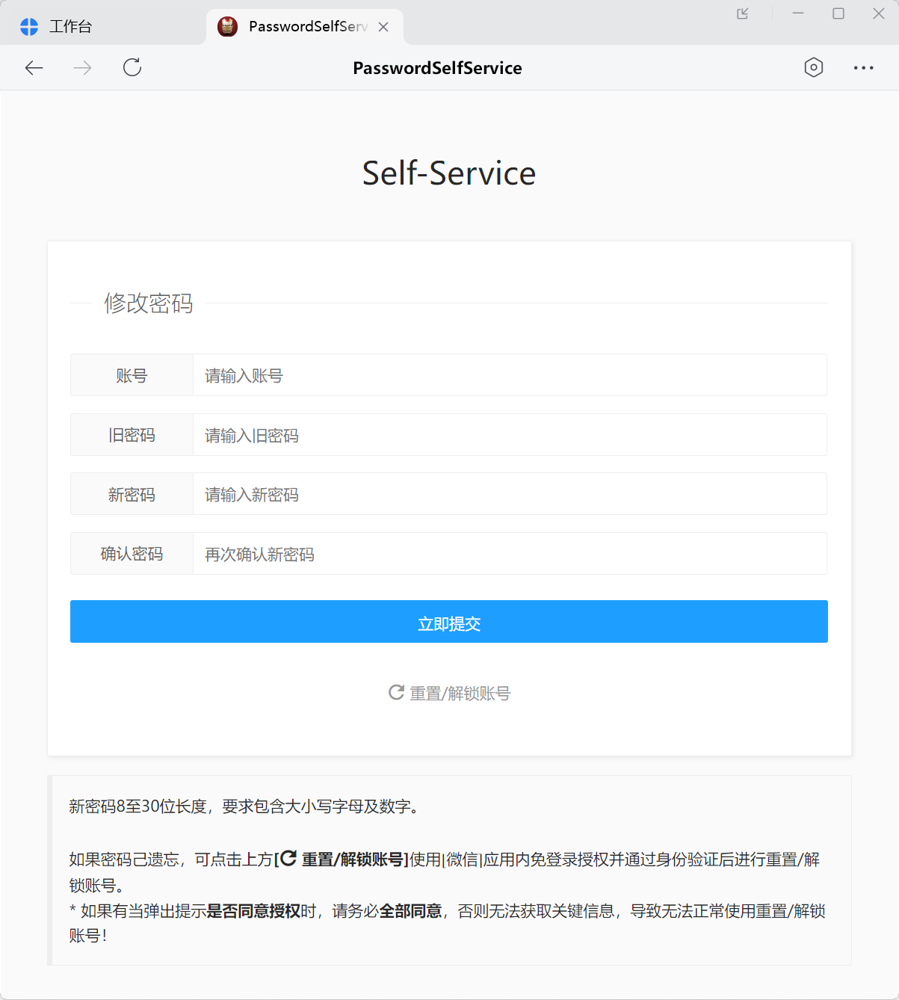   


   

### 移动端

   

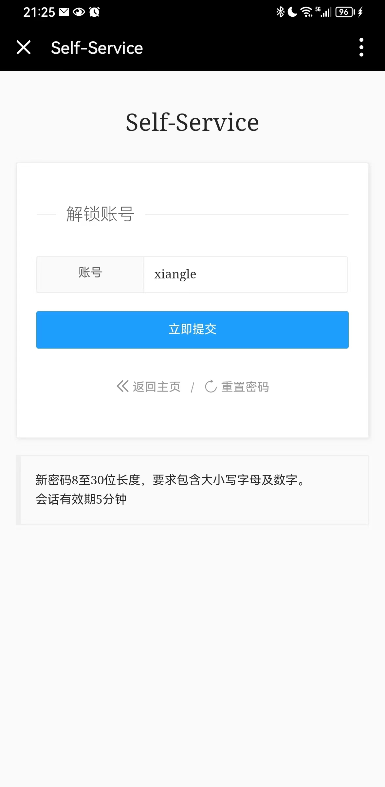   

---

## 常见问题 (FAQ)

### Q: 如何修改默认配置项？
**A:** 编辑 `conf/config.dev.yaml` 或 `conf/config.prod.yaml`，或通过环境变量覆盖。

### Q: 如何支持自定义 OAuth 提供商？
**A:** 在 `utils/oauth/providers/` 中创建新的提供商类，继承 `BaseOAuthProvider`，实现必要方法。

### Q: 支持哪些 LDAP 服务器？
**A:** 目前支持 Active Directory (AD) 和 OpenLDAP，其他 LDAP 兼容服务器可能需要适配。

### Q: 如何启用 SSL 证书验证？
**A:** 在 `config.yaml` 中设置 `ldap.ad.tls.validate: "required"` 并配置 CA 证书路径。

### Q: SMS 短信服务如何配置？
**A:** 支持阿里云、腾讯云、华为云，在 `config.yaml` 中配置相应提供商和 API 密钥。

---

## 许可证

Creative Commons Attribution 4.0 International
